<div style="text-align: center; font-size: 36px;">
计算机图形学
</div>

<div style="text-align: center;">
第二次作业：网格编辑
</div>

## 一.概述


这个作业主要实现了贝塞尔曲线和曲面，并通过加权面积的顶点法线实现了曲面的平滑着色。最后实现边翻转和边分割，并凭借这两个函数实现loop细分，使物体更加平滑。


## 二.贝塞尔曲线和曲面

### 1. 基于 1D de Casteljau 绘制贝塞尔曲线

de Casteljau 算法是一种用于递归计算贝塞尔曲线上任意点的几何算法。它基于控制点的线性插值，并且与贝塞尔曲线的定义完全一致，适用于任何阶数的贝塞尔曲线。算法的核心思想是：通过在相邻控制点之间进行线性插值，逐步计算中间控制点，直到得到曲线上的一个点。它的主要公式是：
$$
P_0'(t) = (1 - t) P_0 + t P_1
$$
我实现了以下这个函数：

```
std::vector<Vector2D> BezierCurve::evaluateStep(std::vector<Vector2D> const& points)
{
    size_t size = points.size();
    std::vector<Vector2D> res;
    for (int i = 0; i < size - 1; i++) {
        Vector2D temp;
        temp.x = (1 - t) * points[i].x + t * points[i + 1].x;
        temp.y = (1 - t) * points[i].y + t * points[i + 1].y;

        res.push_back(temp);
    }

    return res;
}
```

这个函数通过遍历传入的数组，返回这个数组的下一次迭代结果。

例如：一个size为n的points，经过n-1次这个函数，最终返回的数组将只有一个值

以下是按E依次迭代和按C显示完整贝塞尔曲线的截图：


<div style="display: flex; flex-wrap: wrap; justify-content: flex-start;">
    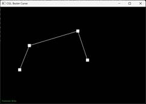
    
    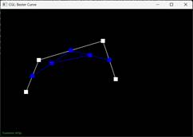
    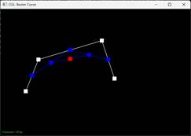
    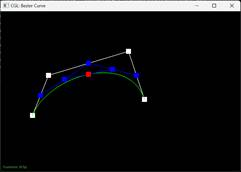
</div>

### 2.基于1D de Cateljau绘制贝塞尔曲面

首先要将贝塞尔曲线迭代转化为贝塞尔曲面迭代，实现以下函数：

```c++
std::vector<Vector3D> BezierPatch::evaluateStep(std::vector<Vector3D> const& points, double t) const
{
    size_t size = points.size();
    std::vector<Vector3D> res;
    if (size < 2)return res;
    for (int i = 0; i < size - 1; i++) {
        Vector3D temp;
        temp.x = (1 - t) * points[i].x + t * points[i + 1].x;
        temp.y = (1 - t) * points[i].y + t * points[i + 1].y;
        temp.z = (1 - t) * points[i].z + t * points[i + 1].z;

        res.push_back(temp);
    }

    return res;
}
```

可以看到，这个函数和1部分基本类似，只是将Vertor2D改为Vertor3D。

接着要实现一次性迭代到一个点的函数，这个函数只需在内部调用前一个evaluateStep函数即可：

```C++
Vector3D BezierPatch::evaluate1D(std::vector<Vector3D> const &points, double t) const
{   
    std::vector<Vector3D> temp = points;
    while (temp.size() > 1) {
        temp = evaluateStep(temp, t);
    }
    return temp.empty() ? Vector3D() : temp.back();
}
```

最后要实现贝塞尔曲面的绘制，即在三维空间中先沿u迭代一轮，再把迭代的结果数组沿v迭代一轮，最后返回去贝塞尔曲面的点。这个函数仅需要再内部调用前一个函数：

```C++
Vector3D BezierPatch::evaluate(double u, double v) const 
{  
    std::vector<Vector3D> temp;
    if (!controlPoints.size())return Vector3D();
    for (int i = 0; i < controlPoints.size(); i++) {
        temp.push_back(evaluate1D(controlPoints[i], u));
    }

    return evaluate1D(temp, v);
}
```

成功执行这个函数后，我们可以执行控制台命令看到一个茶壶的贝塞尔曲面绘制图像：

 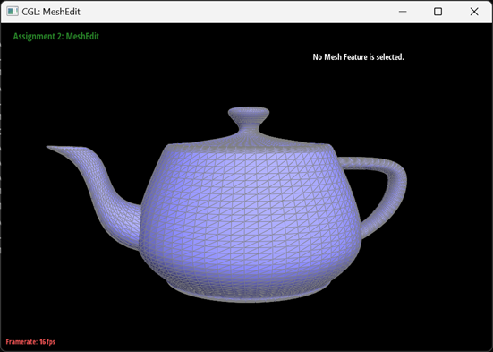

## 三.三角网格和半边数据结构

### 3. 基于面积加权的顶点法线计算

计算基于面积加权的顶点法线有四个步骤：

① 计算每个面的法线（可以通过cross函数来实现）

② 计算每个三角形的面积（通过法线计算）

③ 将每个面和其对应法线的乘积相加

④ 最后将相加结果归一化，得到最终结果

以下是实现的代码：

```C++
Vector3D Vertex::normal( void ) const
{
    Vector3D res;
    HalfedgeCIter h = halfedge();

    HalfedgeCIter ptr = h;

    do {
        Vector3D p0 = h->vertex()->position;
        Vector3D p1 = h->next()->vertex()->position;
        Vector3D p2 = h->next()->next()->vertex()->position;

        Vector3D c = cross(p1 - p0, p2 - p0);
        //Vector3D c = cross(p0 - p1, p0 - p2);
        //c *= -1;
        double area = c.norm() / 2.0;
        res += c * area;

        h = h->twin()->next();
    } while (h != ptr);

    return res.unit();
}
```

实现这个函数后，可以按Q来对物体进行平滑着色，下面是茶壶平滑着色前后的对比：

<div style="display: flex; flex-wrap: wrap; justify-content: flex-start;">
    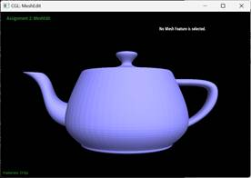
    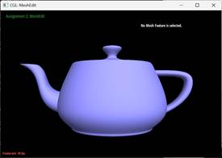
</div>

我关闭了网格显示来使得平滑着色更明显。

### 4.边翻转(Edge Flip)

边翻转有三个操作步骤：

① 确定相邻三角形

② 翻转它们的相邻边

③ 检查翻转的合法性（设置这两个新三角形的相关属性）

边翻转没有创造任何新边，只是将原有的边所相关的参数重新设置，在我的函数中，为了保险起见，我重新设置了近乎所有相关的属性，即使其中有些是不必要的，这显得我的代码看的有一些臃肿，但是也保证了程序运行的安全性。以下是我的实现代码：

```c++
EdgeIter HalfedgeMesh::flipEdge( EdgeIter e0 )
{
    HalfedgeIter h1 = e0->halfedge();
    HalfedgeIter h2 = h1->twin();

    if (h1->isBoundary() || h2->isBoundary()) {
        return e0;
    }
    VertexIter v1 = h1->vertex();
    VertexIter v2 = h2->vertex();
    VertexIter v3 = h1->next()->next()->vertex();
    VertexIter v4 = h2->next()->next()->vertex();
    

    FaceIter f1 = h1->face();
    FaceIter f2 = h2->face();

    HalfedgeIter h1_next = h1->next();
    HalfedgeIter h2_next = h2->next();
    HalfedgeIter h1_prev = h1_next->next();
    HalfedgeIter h2_prev = h2_next->next();

    EdgeIter e1 = h1_next->edge();
    EdgeIter e2 = h2_next->edge();
    EdgeIter e3 = h1_prev->edge();
    EdgeIter e4 = h2_prev->edge();


    h1->setNeighbors(h1_prev, h2, v4, e0, f1);
    h2->setNeighbors(h2_prev, h1, v3, e0, f2);

    h1_next->setNeighbors(h2, h1_next->twin(), v2, h1_next->edge(), f2);
    h2_next->setNeighbors(h1, h2_next->twin(), v1, h2_next->edge(), f1);

    h1_prev->setNeighbors(h2_next, h1_prev->twin(), v3, h1_prev->edge(), f1);
    h2_prev->setNeighbors(h1_next, h2_prev->twin(), v4, h2_prev->edge(), f2);


    f1->halfedge() = h1;
    f2->halfedge() = h2;

    e0->halfedge() = h1;
    e1->halfedge() = h1_next;
    e2->halfedge() = h2_next;
    e3->halfedge() = h1_prev;
    e4->halfedge() = h2_prev;

    v1->halfedge() = h2_next;
    v2->halfedge() = h1_next;
    v3->halfedge() = h1_prev;
    v4->halfedge() = h2_prev;

    return e0;
}
```

通过这个代码我可以对边进行翻转（非边界边）:

<div style="display: flex; flex-wrap: wrap; justify-content: flex-start;">
    <div style="width: 50%; margin-bottom: 10px; text-align: center;">
    
    <span>翻转边</span>
</div>
    <div style="width: 50%; margin-bottom: 10px; text-align: center;">
    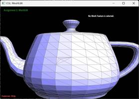
        <span>多次翻转边</span>
</div>
</div>


### 5.边分割（Edge Split）

边分割需要一下操作步骤：

① 确定要分割的边

② 添加新顶点

③ 更新网格拓扑，维护拓扑结构

边分割不同边翻转，它需要创建一个新顶点，因此也会创建三条新边，六条新半边以及两个新面。因此我们需要对很多数据进行维护，我依旧采用像边分割一样的思路，把我认为应该维护的属性全部维护，来保证我分割边逻辑的正确性。由于我操作的图形全部都是封闭图形，因此我没有考虑对边界边进行分割。

以下是我进行边分割的代码：

```C++
VertexIter HalfedgeMesh::splitEdge(EdgeIter e) {
    HalfedgeIter h1 = e->halfedge();
    HalfedgeIter h2 = h1->twin();

    if (h1->isBoundary() || h2->isBoundary()) {
        return VertexIter(); 
    }

    VertexIter v1 = h1->vertex();
    VertexIter v2 = h2->vertex();
    VertexIter v3 = h1->next()->next()->vertex();
    VertexIter v4 = h2->next()->next()->vertex();

    HalfedgeIter h1_next = h1->next();
    HalfedgeIter h2_next = h2->next();
    HalfedgeIter h1_prev = h1_next->next();
    HalfedgeIter h2_prev = h2_next->next();


    Vector3D midpoint = (v1->position + v2->position) * 0.5;
    VertexIter newVertexIter = newVertex();
    newVertexIter->position = midpoint;
    newVertexIter->isNew = true;

    HalfedgeIter newH1 = h1;
    HalfedgeIter newH2 = h2;
    HalfedgeIter newH3 = newHalfedge();
    HalfedgeIter newH4 = newHalfedge();
    HalfedgeIter newH5 = newHalfedge();
    HalfedgeIter newH6 = newHalfedge();
    HalfedgeIter newH7 = newHalfedge();
    HalfedgeIter newH8 = newHalfedge();
    
    EdgeIter newE1 = h1->edge();
    EdgeIter newE2 = newEdge();
    EdgeIter newE3 = newEdge();
    EdgeIter newE4 = newEdge();

    EdgeIter E1 = h1_next->edge();
    EdgeIter E2 = h2_next->edge();
    EdgeIter E3 = h1_prev->edge();
    EdgeIter E4 = h2_prev->edge();


    FaceIter newF1 = h1->face();
    FaceIter newF2 = h2->face();
    FaceIter newF3 = newFace();
    FaceIter newF4 = newFace();

    newH1->setNeighbors(newH5, newH2, v1, newE1, newF1);
    newH2->setNeighbors(h2_next, newH1, newVertexIter, newE1, newF2);
    newH3->setNeighbors(h1_next, newH4, newVertexIter, newE2, newF3);
    newH4->setNeighbors(newH8, newH3, v2, newE2, newF4);
    newH5->setNeighbors(h1_prev, newH6, newVertexIter, newE3, newF1);
    newH6->setNeighbors(newH3, newH5, v3, newE3, newF3);
    newH7->setNeighbors(newH2, newH8, v4, newE4, newF2);
    newH8->setNeighbors(h2_prev, newH7, newVertexIter, newE4, newF4);

    h1_next->setNeighbors(newH6, h1_next->twin(), v2, h1_next->edge(), newF3);
    h2_next->setNeighbors(newH7, h2_next->twin(), v1, h2_next->edge(), newF2);
    h1_prev->setNeighbors(newH1, h1_prev->twin(), v3, h1_prev->edge(), newF1);
    h2_prev->setNeighbors(newH4, h2_prev->twin(), v4, h2_prev->edge(), newF4);

    v1->halfedge() = newH1;
    v2->halfedge() = newH4;
    v3->halfedge() = newH6;
    v4->halfedge() = newH7;
    newVertexIter->halfedge() = newH2;

    newE1->halfedge() = newH1;
    //newE1->isNew = true;
    newE2->halfedge() = newH3;
    //newE2->isNew = true;
    newE3->halfedge() = newH5;
    newE3->isNew = true;
    newE4->halfedge() = newH7;
    newE4->isNew = true;

    E1->halfedge() = h1_next;
    E2->halfedge() = h2_next;
    E3->halfedge() = h1_prev;
    E4->halfedge() = h2_prev;

    newF1->halfedge() = newH1;
    newF2->halfedge() = newH2;
    newF3->halfedge() = newH3;
    newF4->halfedge() = newH4;


    return newVertexIter;
}
```

通过这个代码，我可以实现边分割操作：

<div style="display: flex; flex-wrap: wrap; justify-content: flex-start;">
    <div style="width: 33%; margin-bottom: 10px; text-align: center;">
    
    <span>分割一条边</span>
</div>
    <div style="width: 33%; margin-bottom: 10px; text-align: center;">
    
        <span>多次分割一条边</span>
</div>
    <div style="width: 33%; margin-bottom: 10px; text-align: center;">
    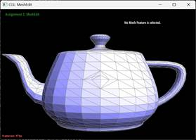
        <span>分割边与翻转边组合</span>
</div>
</div>

### 6.利用Loop Subdivision进行网格上采样

我的loop细分主要分为以下几个步骤：

① 先把网格中所有点和所有边的isNew置为false：

```C++
for (VertexIter v = mesh.verticesBegin(); v != mesh.verticesEnd(); v++) {
    v->isNew = false;
}
for (EdgeIter e = mesh.edgesBegin(); e != mesh.edgesEnd(); e++) {
    e->isNew = false;
}
```

这一步是为了对网格属性进行初始化，避免后续重复细分时因为点和边的isNew未正确设置导致无法细分。

②对每条边计算出它的中点值，存储到边的newPosition中，然后对每条边进行分割，把分割后的返回的新点的position设置为边的newPosition:
$$
P_e = \frac{3}{8}(P_1 + P_2) + \frac{1}{8}(P_3 + P_4)
$$

```C++
std::vector<EdgeIter> edgesToSplit;
for (EdgeIter e = mesh.edgesBegin(); e != mesh.edgesEnd(); ++e) {
    HalfedgeIter h = e->halfedge();
    Vector3D A = h->vertex()->position;
    Vector3D B = h->twin()->vertex()->position;
    Vector3D C = h->next()->next()->vertex()->position;
    Vector3D D = h->twin()->next()->next()->vertex()->position;
    e->newPosition = 3.0f / 8.0f * (A + B) + 1.0f / 8.0f * (C + D);
    edgesToSplit.push_back(e);
}
for (EdgeIter e : edgesToSplit) {
    VertexIter newVertex = mesh.splitEdge(e);
    newVertex->position = e->newPosition;
}
```

③对可以翻转的边进行翻转

```C++
for (EdgeIter e = mesh.edgesBegin(); e != mesh.edgesEnd(); ++e) {
    if (e->isNew) {
        VertexIter v1 = e->halfedge()->vertex();
        VertexIter v2 = e->halfedge()->twin()->vertex();

        if ((v1->isNew && !v2->isNew)||(!v1->isNew && v2->isNew)) {
            mesh.flipEdge(e);
        }
    }
}
```

先判断是不是新边，再判断这条边是否链接旧顶点和新顶点

④ 对非新生成的点计算它们在细分后的新位置:
$$
P'_i = (1 - n \cdot \beta) P_i + \beta \sum_{j=1}^{n} P_j
$$

```C++
for (VertexIter v = mesh.verticesBegin(); v != mesh.verticesEnd(); ++v) {
    if (!v->isNew) {
        size_t n = v->degree();
        double u = (n == 3) ? (3.0 / 16.0) : (3.0 / (8.0 * n));
        Vector3D neighborSum(0, 0, 0);

        HalfedgeIter h = v->halfedge();
        HalfedgeIter hStart = h;
        do {
            neighborSum += h->twin()->vertex()->position;
            h = h->twin()->next();
        } while (h != hStart);

        v->newPosition = (1.0 - n * u) * v->position + u * neighborSum;
    }
}
```

利用这个新位置计算公式可以使细分更加平滑

 ⑤最后更新所有旧点的位置:

```C++
for (VertexIter v = mesh.verticesBegin(); v != mesh.verticesEnd(); ++v) {
    if (!v->isNew) {
        v->position = v->newPosition;
    }
}
```

下面是茶壶进行细分的截图：

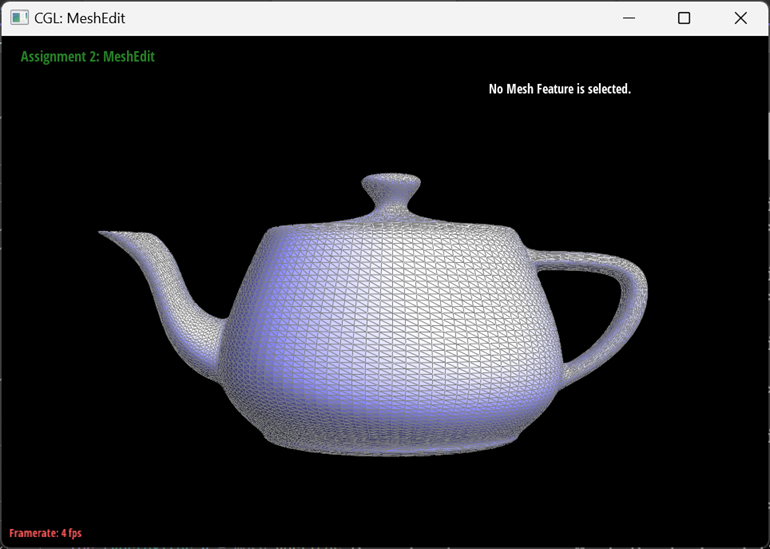

进行两次细分后的茶壶，可以看到它的表面已经变得十分光滑

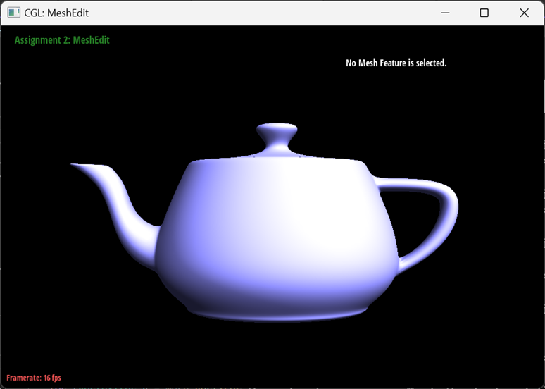

关闭网格再进行平滑着色，已经十分的完美。

<div style="display: flex; flex-wrap: wrap; justify-content: flex-start;">
    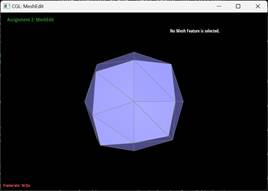
    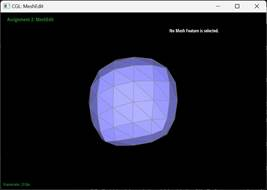
    
    
</div>

对立方体进行四次细分的结果。

## 四.实践与思考

在我进行最后一步loop细分的时候，曾经遇到了两个问题：

一个是细分不规则：

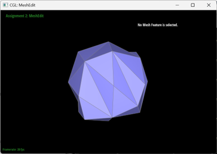

这个问题在我调试后发现是我一些边没有通过isNew判定来赋position，于是在边分割中我添加了设置新点和新边的isNew为True的语句，这个问题因此解决。

```C++
newE1->halfedge() = newH1;
//newE1->isNew = true;
newE2->halfedge() = newH3;
//newE2->isNew = true;
newE3->halfedge() = newH5;
newE3->isNew = true;
newE4->halfedge() = newH7;
newE4->isNew = true;
```

```C++
Vector3D midpoint = (v1->position + v2->position) * 0.5;
VertexIter newVertexIter = newVertex();
newVertexIter->position = midpoint;
newVertexIter->isNew = true;
```

第二个问题是我loop细分的图像，在有直角顶点的地方没有正确的变光滑：

<div style="display: flex; flex-wrap: wrap; justify-content: flex-start;">
    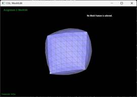
    
</div>

经过排查，我发现可以再最后再算一次网格中旧顶点的位置来修正这个问题，即上文中loop细分里的步骤⑥。只需要将最后一步的newPosition改为position，这样子细分后的立方体的顶角位置就可以正确进行更新

```C++
v->position = (1.0 - n * u) * v->position + u * newPos;
```

